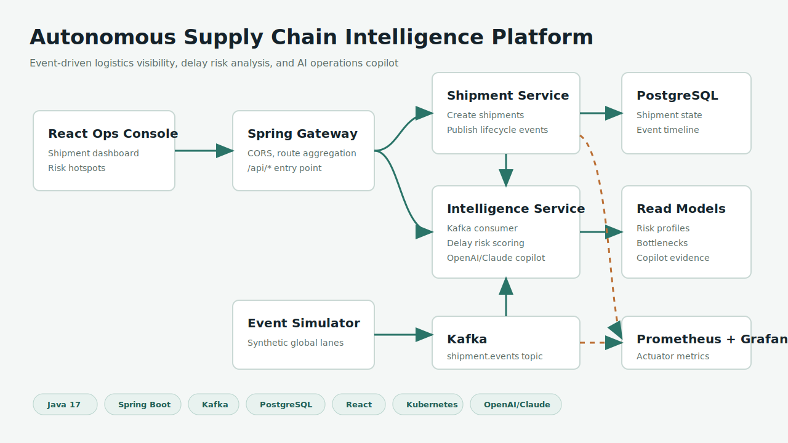
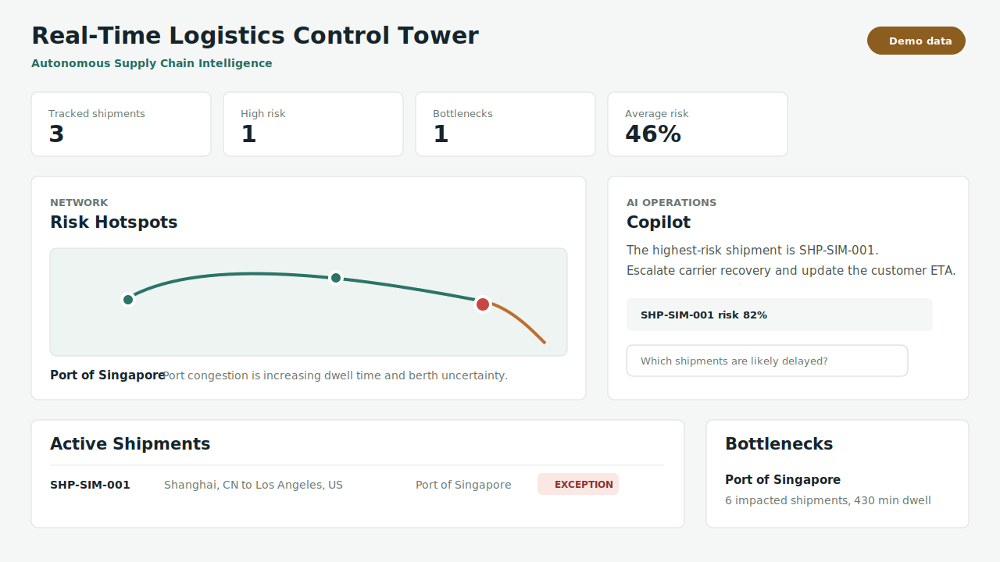
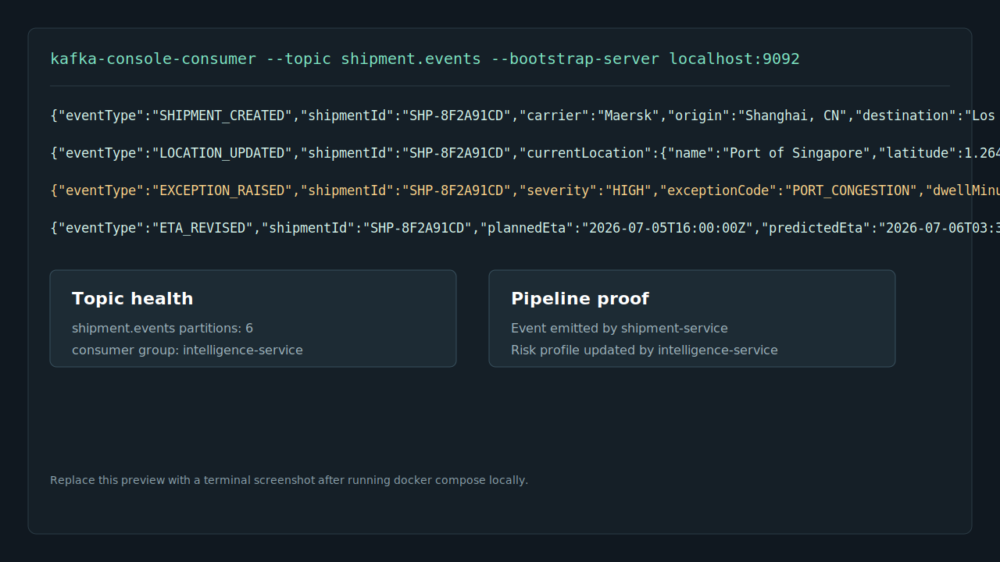
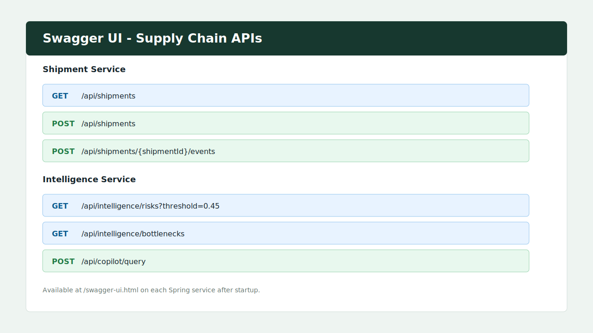
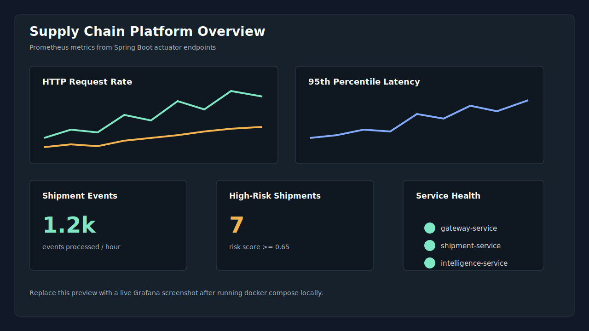

# Autonomous Supply Chain Intelligence Platform

Production-style supply chain intelligence platform for real-time logistics visibility, exception management, delay prediction, bottleneck detection, and AI operations copiloting.

## Recruiter Quick View



| Dashboard | Kafka Stream |
| --- | --- |
|  |  |

| Swagger / API | Grafana |
| --- | --- |
|  |  |

Demo assets:

- [2-3 minute demo video script](docs/demo/demo-video.md)
- [Screenshot capture checklist](docs/demo/capture-checklist.md)
- [API response samples](docs/evidence/api-response-samples.md)
- [Kafka consumer sample](docs/evidence/kafka-consumer-sample.txt)

## Tech Stack

- Java 17, Spring Boot, Spring Kafka, Spring Data JPA, Spring Cloud Gateway
- Apache Kafka for event-driven shipment, ETA, warehouse, and exception streams
- PostgreSQL persistence with Flyway migrations
- React + TypeScript operations dashboard
- Springdoc OpenAPI Swagger UI
- OpenAI or Claude-backed logistics copilot with deterministic fallback
- Docker Compose for local development
- Kubernetes manifests for cloud-native deployment on AKS, EKS, or any conformant cluster
- Prometheus and Grafana observability
- GitHub Actions CI

## Architecture

```text
React Ops Console
       |
Spring Cloud Gateway
       |
       +--> Shipment Service ---- PostgreSQL
       |          |
       |          +---- shipment.events ----+
       |                                    |
       +--> Intelligence Service <----------+
                  |
                  +---- risk profiles, bottlenecks, copilot answers

Event Simulator ---- shipment.events

Prometheus scrapes actuator metrics from services.
Grafana visualizes API latency, event processing, and risk signals.
```

## Modules

- `platform-common` - shared event contracts and logistics domain types.
- `shipment-service` - shipment command/query API, event ingestion, Kafka publishing, PostgreSQL-backed operational state.
- `intelligence-service` - Kafka consumer, delay risk scoring, bottleneck/root-cause analysis, operations copilot API.
- `gateway-service` - API gateway routes for frontend and external consumers.
- `event-simulator` - scheduled global logistics event generator for demos.
- `frontend` - real-time operations console and copilot interface.
- `infra` - Docker Compose, Kubernetes, Prometheus, Grafana, and deployment manifests.

## Local Run

Prerequisites: Java 17, Maven 3.9+, Docker, Docker Compose, Node 20+.

```bash
docker compose -f infra/docker-compose.yml up --build
```

Useful URLs:

- Frontend: `http://localhost:5173`
- Gateway: `http://localhost:8080`
- Shipment service: `http://localhost:8081`
- Intelligence service: `http://localhost:8082`
- Shipment Swagger UI: `http://localhost:8081/swagger-ui.html`
- Intelligence Swagger UI: `http://localhost:8082/swagger-ui.html`
- Prometheus: `http://localhost:9090`
- Grafana: `http://localhost:3000` (`admin` / `admin`)

## AI Copilot

The copilot supports three modes:

- `AI_PROVIDER=openai` - sends the safe query plan and result rows to the OpenAI Responses API.
- `AI_PROVIDER=anthropic` - sends the same evidence packet to Claude Messages API.
- `AI_PROVIDER=none` - uses deterministic logistics reasoning, useful for local demos without API keys.

Natural-language questions are mapped to predefined SQL templates in the intelligence service. The LLM never receives permission to generate arbitrary SQL; it only summarizes rows returned by safe query plans such as delay risk, bottleneck, root-cause, and operations summary.

Example OpenAI configuration:

```bash
AI_PROVIDER=openai
OPENAI_API_KEY=your_key_here
OPENAI_MODEL=gpt-4.1-mini
```

Example Claude configuration:

```bash
AI_PROVIDER=anthropic
ANTHROPIC_API_KEY=your_key_here
ANTHROPIC_MODEL=claude-3-5-sonnet-latest
```

## API Examples

Create a shipment:

```bash
curl -X POST http://localhost:8080/api/shipments \
  -H "Content-Type: application/json" \
  -d '{
    "orderNumber": "PO-44519",
    "carrier": "Maersk",
    "origin": "Shanghai, CN",
    "destination": "Los Angeles, US",
    "plannedEta": "2026-07-05T16:00:00Z"
  }'
```

Simulate an exception:

```bash
curl -X POST http://localhost:8080/api/shipments/{shipmentId}/events \
  -H "Content-Type: application/json" \
  -d '{
    "eventType": "EXCEPTION_RAISED",
    "locationName": "Port of Singapore",
    "latitude": 1.2644,
    "longitude": 103.8200,
    "dwellMinutes": 420,
    "severity": "HIGH",
    "exceptionCode": "PORT_CONGESTION",
    "notes": "Vessel waiting for berth assignment."
  }'
```

Ask the copilot:

```bash
curl -X POST http://localhost:8080/api/copilot/query \
  -H "Content-Type: application/json" \
  -d '{"question":"Which shipments are likely delayed and what should ops do next?"}'
```

OpenAPI docs are available at `/swagger-ui.html` on each Spring service.

## Validation

```bash
mvn test
cd frontend
npm install
npm run build
```

## Cloud Deployment

The Kubernetes manifests in `infra/kubernetes` define Deployments, Services, ConfigMaps, Secrets templates, PostgreSQL, Kafka, and ingress-ready service wiring. For AKS/EKS, replace the local storage classes and ingress annotations with your cloud defaults, then deploy:

```bash
kubectl apply -f infra/kubernetes/
```

## Portfolio Highlights

- Event-driven microservices with Kafka topics for shipment lifecycle events.
- Low-latency operational read models backed by PostgreSQL.
- AI copilot integration for OpenAI or Claude, with safe natural-language-to-query planning and deterministic fallback.
- Cloud-native packaging with Docker, Kubernetes readiness/liveness probes, and actuator metrics.
- Monitoring stack with Prometheus scrape configuration and Grafana provisioning.

## Resume Line

Autonomous Supply Chain Intelligence Platform - Java, Spring Boot, Kafka, PostgreSQL, Docker, Kubernetes, React

Built a production-style supply chain visibility platform using Spring Boot microservices, Kafka event streaming, PostgreSQL persistence, Kubernetes deployment manifests, and React dashboard to track shipments, detect delays, analyze bottlenecks, and support AI-powered logistics operations.
